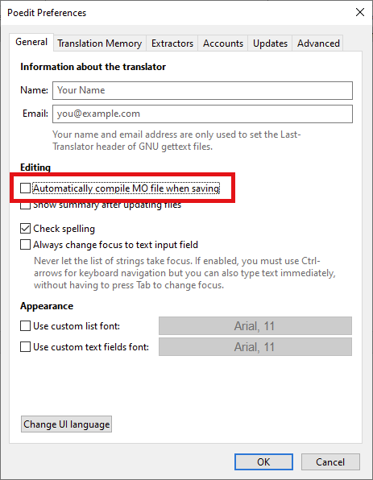
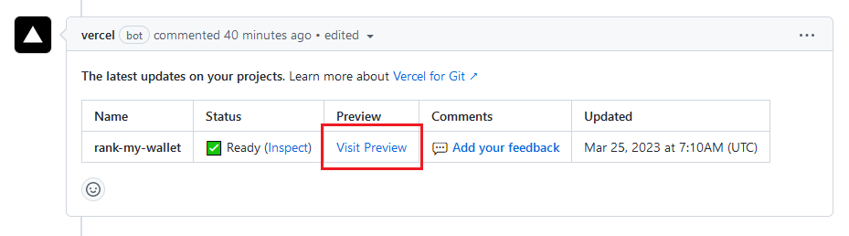

# Contributions Welcome

## Contributor Covenant

Please note that this project is released with a Contributor Code of Conduct. By participating in this project you agree to abide by its terms.

You can view the latest version of the Contributor Covenant [here](https://www.contributor-covenant.org/version/2/1/code_of_conduct).

## PR Guidelines

- Scope pull requests (related changes only)
- Make sure [existing tests](./test) pass
- Add new tests if new functionality is added
- For UI changes, point to preview environment for your PR

## Requirements

```
npm run lint
npm run test
npx tsc
```

## Translations

TRANSLATORS DO NOT REQUIRE CODING SKILLS!

### Requirements

Either use the Github website or download [PoEdit](https://poedit.net/).

If you are using PoEdit, create a local copy of the source files by running:

```
git clone git@github.com:alt3/rank-my-wallet.git
```

### PoEdit

1. Open PoEdit

2. Select menu item `File`, then select `Preferences`

3. On the `General` tab, **uncheck** option `Automatically compile MO files when saving`

   

### Updating existing translations

1. Open the `messages.po` file for the specific language, found in the [translations folder](https://github.com/alt3/rank-my-wallet/tree/main/src/translations/locales)

2. Make and save changes

3. Submit your changes by creating a Pull Request

4. Make sure to doublecheck your changes by using the [Vercel website preview](#vercel-website-preview)

### Adding new translations

Translators without coding skills can:

1. Copy an existing `messages.po` file

2. Update translations in the copied file

3. Submit the copied file by creating a Pull Request

4. We will add the required required technical code to your Pull Request

If you do have coding skills:

1. Add the new locale on [this line in next.config.js](https://github.com/alt3/rank-my-wallet/blob/main/next.config.js#L11)

2. Add the new locale to the [LocaleSwitcher component](https://github.com/alt3/rank-my-wallet/blob/main/src/components/LocaleSwitcher.tsx)

3. Add the new locale to the [next-sitemap configuration file](https://github.com/alt3/rank-my-wallet/blob/main/next-sitemap.config.js#L7)

4. Run `npm run translations:extract` which will create a new `messages.po` file for the new locale in the [translations folder](https://github.com/alt3/rank-my-wallet/tree/main/src/translations/)

5. Update **all** `message.po` files that are now missing the name of your newly added language

6. Submit your changes by creating a Pull Request

7. Make sure to doublecheck your changes by using the [Vercel website preview](#vercel-website-preview)

### Vercel website preview

Every Pull Request creates a Vercel preview website containing your changes:

1. Visit the Pull Request page on github

2. Click on the `Visit Preview` link as shown below:

   
