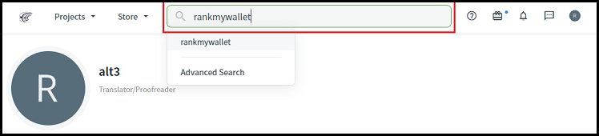
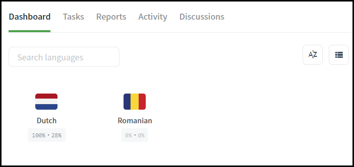

# Contributions Welcome

## Contributor Covenant

Please note that this project is released with a Contributor Code of Conduct. By participating in this project you agree to abide by its terms.

You can view the latest version of the Contributor Covenant [here](https://www.contributor-covenant.org/version/2/1/code_of_conduct).

## PR Guidelines

- Scope pull requests (related changes only)
- Make sure [existing tests](./test) pass
- Add new tests if new functionality is added
- For UI changes, point to preview environment for your PR

## Requirements

```
npm run lint
npm run test
npx tsc
```

## Translations

Translators do not require any coding skills because we use the [Crowdin online editor](https://support.crowdin.com/online-editor/) for all our translations.

### Join RankMyWallet on Crowdin

1. Create a [Crowdin](https://crowdin.com/) account

2. Search for the `rankmywallet` project

   

3. Join the `rankmywallet` project by pressing the `Join` button

### Update existing translations

To update existing translations:

1. First select the language you want to update

   

2. Open the translation editor by pressing the `Translate All` button

3. Find and select the translation string you want to update

4. After you have updated the translation string, press the `Save` button

   

5. That's it, no further action required. Crowdin will automatically create a Pull Request after your suggested changes have been approved.

> For more details about the online editor please visit this [Crowdin documention page](https://support.crowdin.com/enterprise/online-editor/).

### Request new languages

If you want to add a missing language, please create a discussion as shown below.

After we have technically enabled the language, you will receive an email and can start translating.


