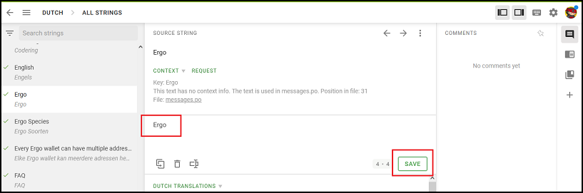

# Contributions Welcome

## Contributor Covenant

Please note that this project is released with a Contributor Code of Conduct. By participating in this project you agree to abide by its terms.

You can view the latest version of the Contributor Covenant [here](https://www.contributor-covenant.org/version/2/1/code_of_conduct).

## PR Guidelines

- Scope pull requests (related changes only)
- Make sure [existing tests](./test) pass
- Add new tests if new functionality is added
- For UI changes, point to preview environment for your PR

## Requirements

```
npm run lint
npm run test
npx tsc
```

## Translations

Because we use the [Crowdin](https://crowdin.com/) web editor for translations, translators do not require any coding skills.

### Joining RankMyWallet on Crowdin

1. Create a [Crowdin](https://crowdin.com/) account

2. Search for the `rankmywallet` project

   

3. Join the `rankmywallet` project by pressing the `Join` button

### Requesting new languages

If you want to add a new language, please start a discussion (so we can technically enable the language).


### Updating existing translations

To update existing translations:

1. First select the language you want to update

   

2. Open the translation editor by pressing the `Translate All` button

3. Find and select the translation string you want to update

4. After you have updated the translation string, press the `Save` button

   

5. That's it, no further action required. Crowdin will automatically create a Pull Request containing your changes within an hour.
